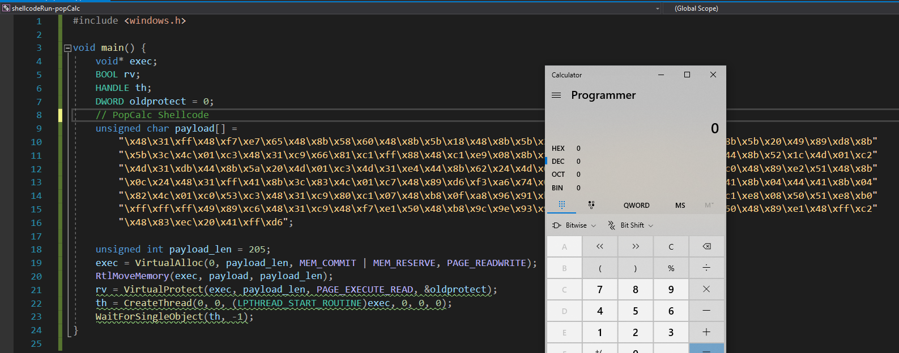

# Windows/x64 - Dynamic Null-Free WinExec PopCalc Shellcode (205 Bytes)
+ Shellcode Author: Bobby Cooke (boku)
+ Date:             May 2nd, 2021
+ Tested on:        Windows 10 v2004 (x64)
## Shellcode Description:
+ 64bit Windows 10 shellcode that dynamically resolves the base address of kernel32.dll via PEB & ExportTable method.
+ Contains no Null bytes (0x00), and therefor will not crash if injected into typical stack Buffer OverFlow vulnerabilities.
+ Grew tired of Windows Defender alerts from MSF code when developing, so built this as a template for development of advanced payloads.



## Compile & get shellcode from Kali:
```bash
nasm -f win64 popcalc.asm -o popcalc.o
for i in $(objdump -D popcalc.o | grep "^ " | cut -f2); do echo -n "\x$i" ; done
```
